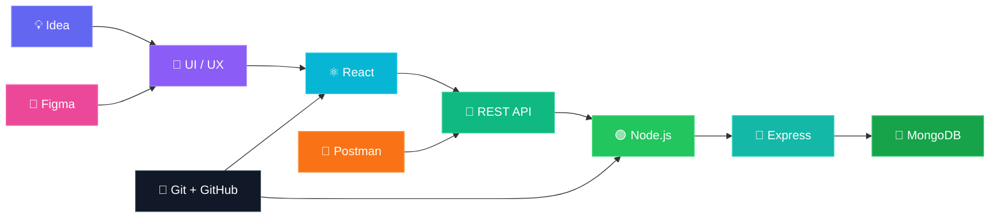
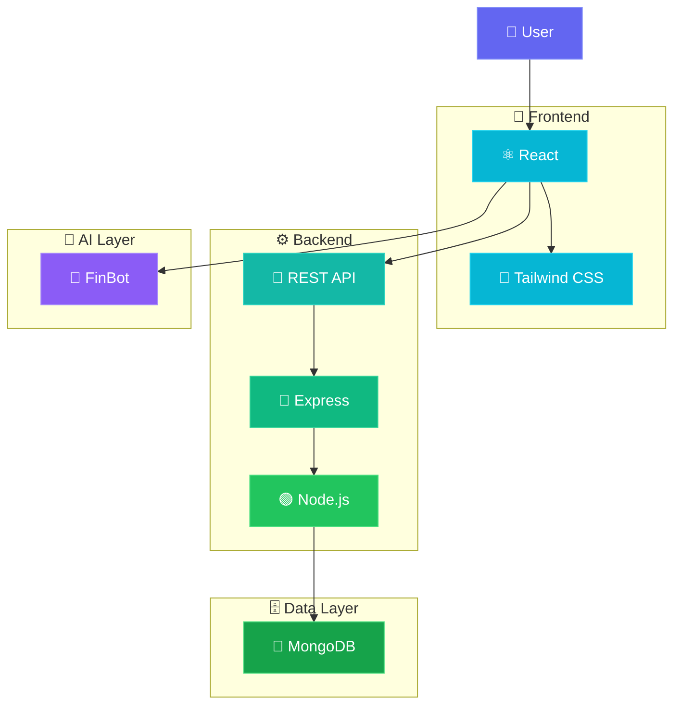

 

 

<h3>Hey, I'm Ravi Kumar 👋</h3>

  <b>Full-Stack Developer focused on building useful, scalable and beautiful digital products.</b>

 

&nbsp;

&nbsp;

  

 

## 👨‍💻 About Me

I'm **Ravi Kumar**, a Full-Stack Web Developer and BCA graduate passionate about building modern web applications that solve real-world problems.

I enjoy working across the complete development lifecycle — from **UI/UX design and frontend development** to **backend APIs, databases, testing, debugging and deployment**.

<table>
<tr>
<td align="center" width="180">

### 🎯

<b>Role</b>

Full-Stack Developer

</td>

<td align="center" width="180">

### ⚡

<b>Core Stack</b>

MERN

</td>

<td align="center" width="180">

### 🎨

<b>Design</b>

UI/UX + Figma

</td>

<td align="center" width="180">

### 🧠

<b>Exploring</b>

AI + ML

</td>
</tr>
</table>

 

### 🚀 What I Do

* Build full-stack applications using the **MERN stack**
* Create responsive and modern interfaces with **React**
* Develop structured **REST APIs**
* Build backend services using **Node.js & Express**
* Work with **MongoDB** and database-driven applications
* Design interfaces and user flows using **Figma**
* Debug, test and improve applications
* Use AI-assisted development tools to improve productivity
* Learn new technologies by building real-world projects

 

# ⚡ My Skills

  

  

  

  

  

  

 

## 🧩 How My Skills Connect

 

# 🚀 Featured Project

## 💰 FinLearn

### Gamified Personal Finance Learning Platform

  

 

> **FinLearn** is a full-stack financial literacy platform designed to make personal finance more interactive, practical and engaging.

### 🎯 The Problem

Financial literacy is often overlooked, especially among students and young people.

FinLearn addresses this gap by combining:

`Education` + `Gamification` + `Practical Tools` + `AI Assistance`

### ✨ Key Features

<table>
<tr>
<td align="center" width="200">

### 🏆

<b>Gamification</b>

XP, streaks, milestones & badges

</td>

<td align="center" width="200">

### 📚

<b>Courses</b>

Structured finance education

</td>

<td align="center" width="200">

### 🤖

<b>FinBot AI</b>

AI-powered learning assistant

</td>
</tr>

<tr>
<td align="center">

### 🧮

<b>Calculators</b>

7 practical finance tools

</td>

<td align="center">

### 🎓

<b>Certificates</b>

Course completion system

</td>

<td align="center">

### 📊

<b>Progress</b>

XP, quizzes & achievements

</td>
</tr>
</table>

 

## 🏗️ FinLearn Architecture

 

### 🛠️ Engineering Highlights

* Component-based React architecture
* RESTful backend API development
* MongoDB database integration
* Client-server communication
* API testing with Postman
* Responsive UI development
* Gamification and progress systems
* AI-assisted development workflow

 

# 🧪 Experience

## ✈️ Skyscanner × Forage

### Front-End Software Engineering Job Simulation

**September 2025**

Completed a practical front-end engineering simulation focused on real-world software development workflows.

 

# 🏅 Certifications

| 🎓 Certification                                           | 🔍 Focus                 |
| :--------------------------------------------------------- | :----------------------- |
| **Skyscanner — Front-End Software Engineering Simulation** | Frontend Engineering     |
| **AI for All**                                             | Artificial Intelligence  |
| **Introduction to C Programming**                          | Programming Fundamentals |
| **C++ Course Completion**                                  | Programming Fundamentals |

 

# 📊 GitHub Analytics

  

  

 

# 🧠 Currently Learning

  

 

# 🔄 How I Build

```mermaid
flowchart LR

    A["💡 Idea"] --> B["🔍 Problem"]
    B --> C["🎨 Design"]
    C --> D["⚛️ Build"]
    D --> E["🔌 API"]
    E --> F["🗄️ Database"]
    F --> G["🧪 Test"]
    G --> H["🚀 Deploy"]
    H --> I["🔄 Improve"]

    style A fill:#6366F1,color:#fff,stroke:#818CF8
    style B fill:#7C3AED,color:#fff,stroke:#8B5CF6
    style C fill:#EC4899,color:#fff,stroke:#F472B6
    style D fill:#06B6D4,color:#fff,stroke:#22D3EE
    style E fill:#14B8A6,color:#fff,stroke:#2DD4BF
    style F fill:#16A34A,color:#fff,stroke:#4ADE80
    style G fill:#F97316,color:#fff,stroke:#FB923C
    style H fill:#10B981,color:#fff,stroke:#34D399
    style I fill:#6366F1,color:#fff,stroke:#818CF8
```

 

> ### I don't want to just write code that works.
>
> **I want to understand the problem, build the right solution and make the experience better.**

 

# 🎯 2026 Focus

  

`BUILD MORE`   `LEARN DEEPER`   `SHIP CONSISTENTLY`

 

# 💡 My Philosophy

<h2>Don't just write code.</h2>

<h1>Build something that solves a real problem.</h1>

 

 

# 🤝 Let's Connect

### Open to opportunities, collaborations and interesting projects.

 

  

📍 **India**   ·   🌐 **Open to Opportunities**

  

<i>"Code with passion. Learn with curiosity. Grow with consistency."</i>

 

