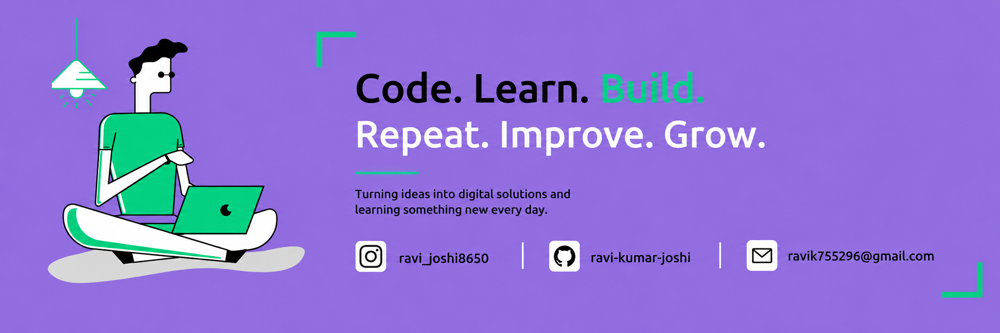

<h1 align="center">Hello  I'm Ravi Kumar</h1>

  
  

<h3 align="center">MERN Stack / Full-Stack Web Developer | BCA Graduate (2026) | Open to Internships & Entry-Level Roles</h3>

 

## 👨🏻‍💻 About Me:

- 🙋‍♂️ MERN Stack developer and BCA graduate (2026), based in Najibabad, Uttar Pradesh, India

- 🔭 Built and deployed **FinLearn** — a full-stack, gamified personal finance web application

- 🌱 Currently exploring `Machine Learning` and advanced web technologies

- 👯 Looking to collaborate on `Dev Projects` and real-world MERN stack builds

- 🤔 Looking for a `MERN Stack / Full-Stack Web Development` internship or entry-level role

- 🧪 Completed Forage's **Skyscanner Front-End Software Engineering Job Simulation**

- 🎨 Also skilled in UI/UX design using **Figma**

- 💬 Ask me about React, Node.js, MongoDB, or anything MERN Stack

- ⚡ Fun fact: I love coding and reading books

 

## 🛠️ Technologies and Tools I use:

 

## 🚀 Featured Project

### 💰 [FinLearn](https://github.com/ravi-kumar-joshi/FinLearn) — Full-Stack Personal Finance Web App

*Dec 2025 – Jun 2026 · MERN Stack · Rama Institute of Higher Education, Kiratpur*

- 🏆 Gamification system with XP tracking, daily streaks, and milestone badges to drive engagement
- 📘 Structured, certificate-granting financial courses on budgeting, investing, saving, and debt management
- 🤖 AI-powered chatbot (FinBot) for personalized finance guidance
- 🧮 7 real-world financial calculators — EMI, SIP, budgeting, loan, inflation, and emergency fund tools
- 🧪 All backend API endpoints tested and validated with Postman for reliable client-server communication
- ⚡ Built using AI-assisted development practices to accelerate coding, debugging, and shipping

🔗 [github.com/ravi-kumar-joshi/FinLearn](https://github.com/ravi-kumar-joshi/FinLearn)

 

## 🧪 Virtual Experience

**Front-End Software Engineering Job Simulation — Skyscanner (via Forage)** · *Sep 2025*
- Completed a job simulation covering practical front-end engineering tasks used by Skyscanner's dev team
- Built a React-based "Backpack" feature app applying component-based architecture and state management
- Practiced real-world front-end workflows: component design, debugging, and code review standards

 

## 🎓 Education

**Bachelor of Computer Applications (BCA)** · Aug 2023 – Aug 2026
Rama Institute of Higher Education, Kiratpur — Computer Applications

 

## 📜 Certifications

- AI for All | Skyscanner — Front-End Software Engineering Job Simulation (Forage)
- Introduction to C Programming
- C++ Course Completion

 

## ❤️ Let's get connected:

 

## 📊 My GitHub Data:

  
  

  

 

<i>"Code with passion. Learn with curiosity. Grow with consistency."</i>
